# Demo CI/CD on AWS for ECS (Blue/Green)

**GitHub → CodePipeline → CodeBuild → CodeDeploy → ECS Fargate + ALB**

This repository showcases an end-to-end, zero-downtime deployment pipeline for a containerized Node.js app on **Amazon ECS (Fargate)** behind an **Application Load Balancer (ALB)**.  
Infrastructure is defined with **Terraform**. Source comes from **GitHub** via **CodeStar Connections**. Builds run in **CodeBuild** and deployments use **CodeDeploy Blue/Green**.

---

## 📊 Architecture



---

## Definition:
Blue/Green: CodeDeploy creates a new task set (green), verifies health on the test listener, then shifts prod traffic.
Buildspec injects the image URI and ECS role ARNs into taskdef.json at build time (no manual edits).
Principle of least privilege: scoped IAM roles for Pipeline/Build/Deploy; execution role for tasks.
Repository Layout

```text
.
├── app/                         # Demo Node.js (port 3000)
│   ├── Dockerfile
│   ├── package.json
│   └── src/server.js
├── pipeline/
│   └── terraform/
│       ├── main.tf
│       ├── variables.tf
│       ├── outputs.tf
│       ├── develop.tfvars       # env variables for demo
│       └── deploy.sh            # local helper (no remote backend)
├── buildspec.yml                # CodeBuild pipeline logic
├── appspec.json                 # CodeDeploy (ECS Blue/Green) template
├── taskdef.json                 # ECS task definition template (filled in at build)
└── .gitignore                   # ignores .terraform/ and *.tfstate
```
--- 

## Requirements
AWS account with permissions for IAM, ECS, ECR, ALB, S3, CodePipeline/Build/Deploy.

AWS CLI v2, Terraform ≥ 1.6, Docker (for local tests).

A CodeStar Connection to GitHub authorized in the AWS console.

Default region used by the demo: us-east-1.

How it Works
Source: GitHub (main) via CodeStar Connection.

Build (CodeBuild):

Build and tag Docker image (ACCOUNT_ID.dkr.ecr.REGION.amazonaws.com/REPO:COMMIT).

Push image to ECR.

Patch taskdef.json with the new image and the execution/task role ARNs (composed from ACCOUNT_ID and role names).

Publish appspec.json + taskdef.json as artifacts.

Deploy (CodeDeploy ECS Blue/Green):

Create a green task set and register it to the test listener.

When targets are healthy, shift production traffic and terminate blue.

# Quick Start
The demo uses local Terraform state (no remote backend) to keep it simple.


## 1) Clone and set your AWS context
git clone https://github.com/<your-user>/<your-repo>.git
cd <your-repo>/pipeline/terraform
export AWS_PROFILE=<your-profile>   # e.g., default
export AWS_REGION=us-east-1

## 2) Provision infrastructure
terraform init
terraform validate
terraform apply -var-file=develop.tfvars -auto-approve

## 3) Authorize the GitHub connection
 Console → Developer Tools → Connections → your connection → "Update/Authorize" until "Available"

## 4) Trigger the pipeline (or just push to main)
 Console → CodePipeline → select pipeline → Release change

## 5) Verify
```text
terraform output -json | jq -r '.alb_dns_name.value'
curl -i http://<ALB_DNS>/
Configuration & Conventions
Container name is app and listens on 3000 (must match taskdef.json, appspec.json, and ECS Service).

ALB has two listeners: 80 (prod) and 9001 (test) with separate target groups.

Target Group names must be ≤ 32 chars in total (ALB constraint).

Terraform variables for the demo live in develop.tfvars:

hcl

region               = "us-east-1"
app_name             = "codestar"
cluster_name         = "codestar-ecs-cluster"
service_name         = "demo-ecs-service"
artifact_bucket_name = "ks-devops-artifacts-demo"
tg_blue_name         = "tg-blue"
tg_green_name        = "tg-green"
CI/CD Artifacts
```
---

# Aditional information about modules
## buildspec.yml (core excerpt)
```yaml

version: 0.2
env:
  variables:
    AWS_REGION: us-east-1
    REPO_NAME: demo-aws-cicd-ecs-codestar

phases:
  pre_build:
    commands:
      - set -euxo pipefail
      - ACCOUNT_ID=$(aws sts get-caller-identity --query Account --output text)
      - REPO_URI="${ACCOUNT_ID}.dkr.ecr.${AWS_REGION}.amazonaws.com/${REPO_NAME}"
      - aws ecr describe-repositories --repository-names "$REPO_NAME" --region "$AWS_REGION" >/dev/null 2>&1 || \
        aws ecr create-repository --repository-name "$REPO_NAME" \
          --image-scanning-configuration scanOnPush=true \
          --encryption-configuration encryptionType=AES256 \
          --region "$AWS_REGION"
      - aws ecr get-login-password --region "$AWS_REGION" | docker login --username AWS --password-stdin "${ACCOUNT_ID}.dkr.ecr.${AWS_REGION}.amazonaws.com"
      - RAW_TAG="${CODEBUILD_RESOLVED_SOURCE_VERSION:-latest}"
      - IMAGE_TAG=$(printf '%.12s' "$RAW_TAG" | tr -cd '[:alnum:]._-')
      - IMAGE_URI="${REPO_URI}:${IMAGE_TAG}"
      - export ACCOUNT_ID REPO_URI IMAGE_TAG IMAGE_URI
      - echo "IMAGE_URI=$IMAGE_URI"

  build:
    commands:
      - DOCKER_BUILDKIT=1 docker build --progress=plain -t "$IMAGE_URI" -t "${REPO_URI}:latest" ./app

  post_build:
    commands:
      - docker push "$IMAGE_URI"
      - docker push "${REPO_URI}:latest"
      # Compose role ARNs without calling IAM (no extra permissions needed)
      - EXEC_ROLE_NAME=${EXEC_ROLE_NAME:-ecsTaskExecutionRole}
      - EXEC_ROLE_ARN="arn:aws:iam::${ACCOUNT_ID}:role/${EXEC_ROLE_NAME}"
      - TASK_ROLE_NAME=${TASK_ROLE_NAME:-}
      - |
        if [ -n "$TASK_ROLE_NAME" ]; then
          TASK_ROLE_ARN="arn:aws:iam::${ACCOUNT_ID}:role/${TASK_ROLE_NAME}"
          jq --arg IMG "$IMAGE_URI" --arg EXEC "$EXEC_ROLE_ARN" --arg TASK "$TASK_ROLE_ARN" \
            '.executionRoleArn=$EXEC | .taskRoleArn=$TASK |
             .containerDefinitions |= (map(if .name=="app" then .image=$IMG else . end))' \
            taskdef.json > taskdef.json.tmp
        else
          jq --arg IMG "$IMAGE_URI" --arg EXEC "$EXEC_ROLE_ARN" \
            '.executionRoleArn=$EXEC | del(.taskRoleArn) |
             .containerDefinitions |= (map(if .name=="app" then .image=$IMG else . end))' \
            taskdef.json > taskdef.json.tmp
        fi
      - mv taskdef.json.tmp taskdef.json
artifacts:
  files:
    - appspec.json
    - taskdef.json
appspec.json (ECS Blue/Green)
json

{
  "version": 1,
  "Resources": [
    {
      "TargetService": {
        "Type": "AWS::ECS::Service",
        "Properties": {
          "TaskDefinition": "<TASK_DEFINITION>",
          "LoadBalancerInfo": { "ContainerName": "app", "ContainerPort": 3000 }
        }
      }
    }
  ]
}
```

---

# tail logs in realtime
```bash
aws logs tail /aws/codebuild/<your-build-project> --follow --since 1h \
  --profile $AWS_PROFILE --region $AWS_REGION
ECS service events

aws ecs describe-services --cluster codestar-ecs-cluster --services demo-ecs-service \
  --query 'services[0].events[0:10].[createdAt,message]' --output table \
  --profile $AWS_PROFILE --region $AWS_REGION
CodeDeploy deployment status


APP=codestar-app
DG=codestar-dg
DEPLOY_ID=$(aws deploy list-deployments --application-name "$APP" \
  --deployment-group-name "$DG" --query 'deployments[0]' --output text \
  --profile $AWS_PROFILE --region $AWS_REGION)
aws deploy get-deployment --deployment-id "$DEPLOY_ID" \
  --query 'deploymentInfo.[status,errorInformation]' \
  --profile $AWS_PROFILE --region $AWS_REGION
Target Group health


aws elbv2 describe-target-health --target-group-arn <TG_BLUE_ARN> \
  --query 'TargetHealthDescriptions[].TargetHealth.State' \
  --profile $AWS_PROFILE --region $AWS_REGION
aws elbv2 describe-target-health --target-group-arn <TG_GREEN_ARN> \
  --query 'TargetHealthDescriptions[].TargetHealth.State' \
  --profile $AWS_PROFILE --region $AWS_REGION
Security (minimum viable)
GitHub integration via CodeStar Connections (no PATs).

ECR scan-on-push, S3 encryption for artifacts.

Security Groups: ALB exposes 80/443; service only allows 3000 from the ALB SG.

ecsTaskExecutionRole with AmazonECSTaskExecutionRolePolicy.

Ignore local state and providers:

gitignore

.terraform/
*.tfstate
*.tfstate.backup
.terraform.lock.hcl
Troubleshooting
ALB error: At least two subnets in different AZs → Ensure you pass ≥2 subnets across distinct AZs.

ECS service name/target group length → TG names must be ≤ 32 chars total.

CodeStar connection “Pending/Insufficient permissions” → Re-authorize the connection and add codeconnections:UseConnection to the pipeline role for the specific ARN.

Build: invalid tag "" → Ensure IMAGE_URI is computed/exported before docker build.

Deploy: unable to assume role 'REPLACED_IF_USED' → Make sure taskdef.json is patched with real executionRoleArn (and taskRoleArn only if you actually use a task role).

Green never healthy → Health check path/port (HTTP:3000 /), SG rules from ALB → service, and container logs.
Cleanup


cd pipeline/terraform
terraform destroy -var-file=develop.tfvars -auto-approve
```

---

# Optionally delete the ECR repository and S3 artifact bucket after destroy.

## Roadmap
Canary/linear traffic shifting and CloudWatch Alarms for auto-rollback.
Pre/Post traffic smoke tests with Lambda hooks in appspec.
Slack/Discord notifications via SNS.
Tighter IAM boundaries; rotation/retention for logs & artifacts; dashboards.


#### 📝 License
MIT — use, learn, improve, and share.
```text
possible support at: [kode.soul.kc@gmail.com]
```
